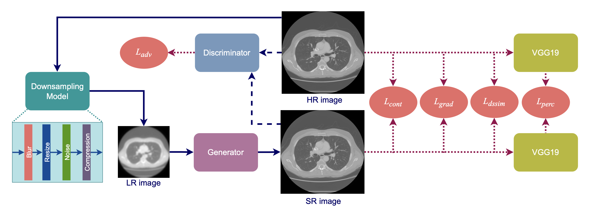

# BliMSR: Blind degradation modelling for generating high-resolution medical images

The repository contains the implementation of the following paper. \
\
Title - **BliMSR: Blind degradation modelling for generating high-resolution medical images** \
Authors - Samiran Dey, Partha Basuchowdhuri, Debasis Mitra, Robin Augustine,  Sanjoy Kumar Saha and Tapabrata Chakraborti \
DOI - https://doi.org/10.1007/978-3-031-48593-0_5

## Abstract
A persisting problem with existing super-resolution (SR) models is that they cannot produce minute details of anatomical structures, pathologies, and textures critical for proper diagnosis. This is mainly because they assume specific degradations like bicubic downsampling or Gaussian noise, whereas, in practice, the degradations can be more complex and hence need to be modelled “blindly”. We propose a novel attention-based GAN model for medical image super-resolution that models the degradation in a data-driven agnostic way (“blind”) to achieve better fidelity of diagnostic features in medical images. We introduce a new ensemble loss in the generator that boosts performance and a spectral normalisation in the discriminator to enhance stability. Experimental results on lung CT scans demonstrate that our model, BliMSR, produces super-resolved images with enhanced details and textures and outperforms recent competing models, including a diffusion model for generating super-resolution images, thus establishing a state-of-the-art.
\
  </img>

# Getting started

## Installation
To install all requirements execute the following line.
```bash
pip install -r requirements.txt
```
And then clone the repository as follows. 
```bash
git clone https://github.com/Samiran-Dey/BliMSR.git
cd BliMSR
```

## Dataset Preparation
The file dataset_random.py helps in preparing the data for training and testing. 

1. Prepare the data tensors as follows -
```bash
from dataset_random import create_dataset
path = HR_image_path
data = create_dataset(path)
```

2. Save the data tensors for further processing - 
```bash
import torch
torch.save(data, save_path)
```

## Train the model
In trainer.py set paths for checkpoints and data. To begin training execute the following command.
```bash
python3 trainer.py
```

# Acknowledgements 
[MedSRGAN](https://github.com/04RR/MedSRGAN) \
[Real_ESRGAN](https://github.com/xinntao/Real-ESRGAN/tree/5ca1078535923d485892caee7d7804380bfc87fd) \
[MHCA](https://github.com/lilygeorgescu/MHCA)

# Citation
```bash
Dey, S., Basuchowdhuri, P., Mitra, D., Augustine, ., Saha, S.K., Chakraborti, T. (2024). BliMSR: Blind Degradation Modelling for Generating High-Resolution Medical Images. In: Waiter, G., Lambrou, T., Leontidis, G., Oren, N., Morris, T., Gordon, S. (eds) Medical Image Understanding and Analysis. MIUA 2023. Lecture Notes in Computer Science, vol 14122. Springer, Cham. https://doi.org/10.1007/978-3-031-48593-0_5
```

```bash
@inbook{Dey2023,
  title = {BliMSR: Blind Degradation Modelling for Generating High-Resolution Medical Images},
  ISBN = {9783031485930},
  ISSN = {1611-3349},
  url = {http://dx.doi.org/10.1007/978-3-031-48593-0_5},
  DOI = {10.1007/978-3-031-48593-0_5},
  booktitle = {Lecture Notes in Computer Science},
  publisher = {Springer Nature Switzerland},
  author = {Dey,  Samiran and Basuchowdhuri,  Partha and Mitra,  Debasis and Augustine,  Robin and Saha,  Sanjoy Kumar and Chakraborti,  Tapabrata},
  year = {2023},
  month = dec,
  pages = {64–78}
}
```


